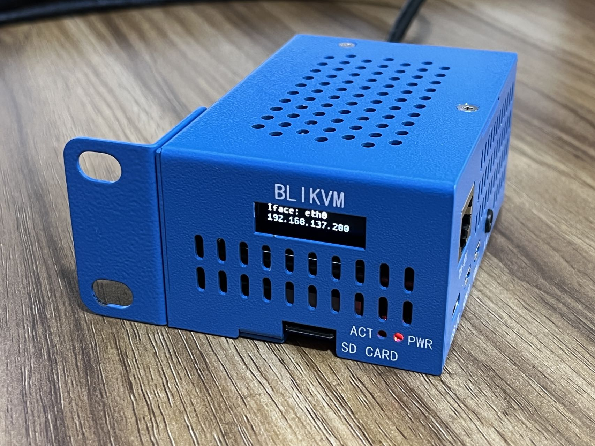
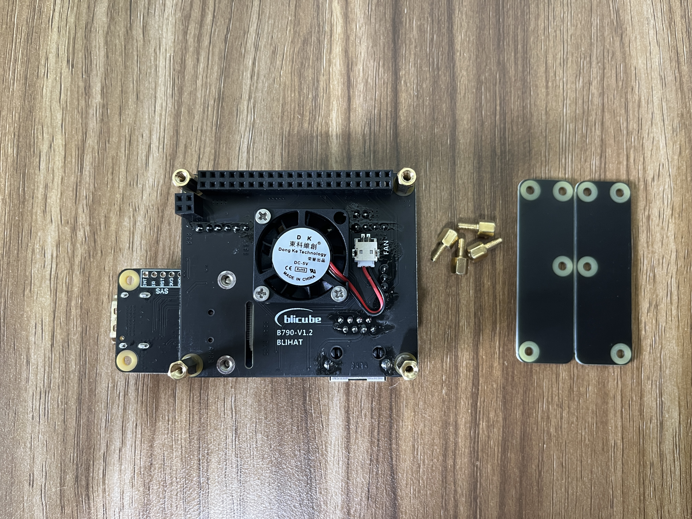
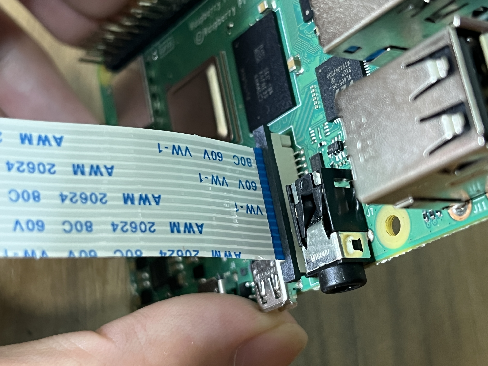

# BLIHAT Installation Guide

## 1.Unpack and take out the devices

Open the protective bag

## 2.Install the main device

Flip to back

Open the case

Flip to back, unscrew the two screws on the back

Open the protective bag and take out the parts

Install Micro SD card

Install the FFC cable

Install the HAT on Raspberry Pi 4

Install four Hex Spacers

Install the C790 module, use the long screws you just removed

Install the audio cable

Stick a heat conductive sheet on the back of the Raspberry Pi 4 , tear off the protective film of the sheet

Install the HAT into the case

Pay attention to the alignment of the holes

Flip to back and install 4 screws

Install five case screws

Install the mounting ear as needed

The main device installation is complete

