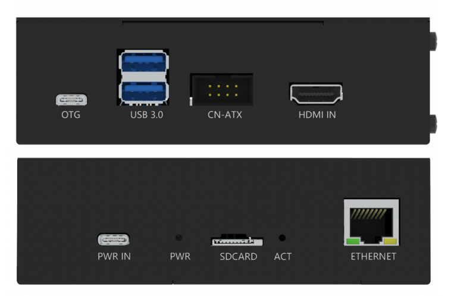
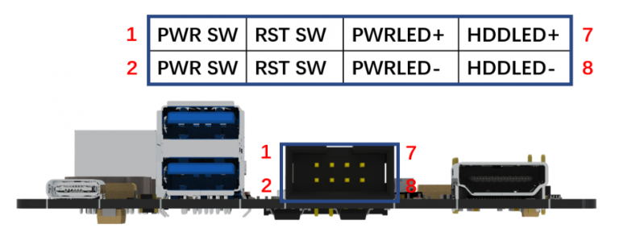

# BLIKVM CM4 version guide 

## **Installation requirements**
!!! note "If you have an assembly kit, you will need the following things"
    * Raspberry CM4 with 1Gb RAM or more.
    * MicroSD card (at least 16Gb, class 10 recommended).
    * USB-C to USB-A cable.
    * HDMI cable.
    * Straight Ethernet cable (for the ATX board connection).
    * Power supply unit (5.1V 3A USB-C, recommended by the Raspberry Pi).

!!! warning "Power supply"
    You must use USB-C to USB-A cable. Use USB-C to USB-C cable can't work, This is an incompatibility in the hardware design and will be 
    fixed in a later version.

## **Basic setup**
**1.** [Flash the memory card or eMMC ](./flashing_os.md) 

**2.Build BLIKVM** according to the video instruction or review the instructions:

??? info "Video Guide: Metal case step by step"
    [PIKVM CM4 (A RPI Compute Module 4 IO Board for PiKVM) BLIKVM Unboxing](https://www.youtube.com/watch?v=aehOawHklGE)
??? info "Geerling Engineering Test video"
    [This Raspberry Pi controls ANY PC (BliKVM)](https://www.youtube.com/watch?v=3OPd7svT3bE)

**3.** Connect BLIKVM to the computer according to the diagram below:
{width="400"}

* HDMI IN and otg port must be connected to the computer. ATX too, but it’s optional, read below. 
There should be no USB hub between BLIKVM and the computer, as some UEFI/BIOS cannot detect them at the boot stage. 
BLIKVM supports 1080p60Hz or lower about HDMI source.
* Connect Ethernet to the network and PWR IN to the BLIKVM power supply.

## **ATX connection**
{width="400"}

To manage the power of your computer, you will connect CN-ATX port to the computer.The user can use the ATX cable 
provided with the product to connect the product and the motherboard ATX switch of the controlled computer. 
The length of the ATX cable is 60CM, you can also use the double female Dupont cables.

{width="400"}

## **Hardware Features**

* 1、HDMI IN port with I2S
* 2、ATX controller interface (power on/off, reboot control, PWR and HDD ACT LEDs)
* 3、USB3.0 port x 2
* 4、USB-C OTG
* 5、Real Time Clock (RTC)
* 6、Gigabit Ethernet
* 7、Activity LED
* 8、Micro SD Card socket
* 9、Power LED
* 10、I2C display connector
* 11、nRPI_BOOT Jumper
* 12、USB-C power input
* 13、FAN connector 5V
* 14、CSI-2 date lanes switch
* 15、CM4 Module Connectors