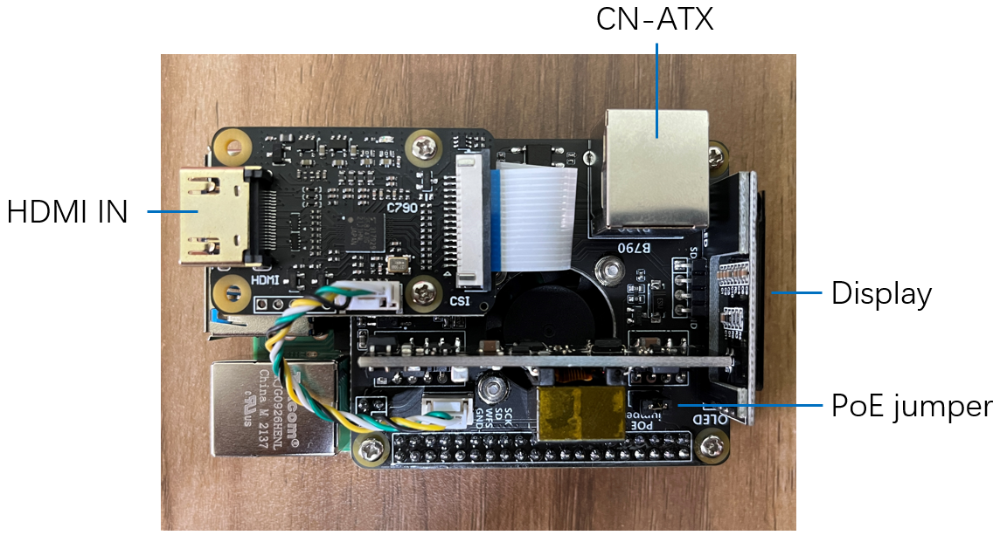
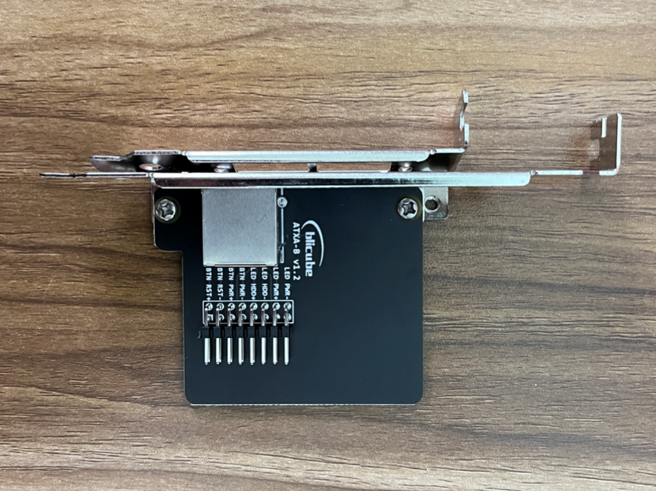
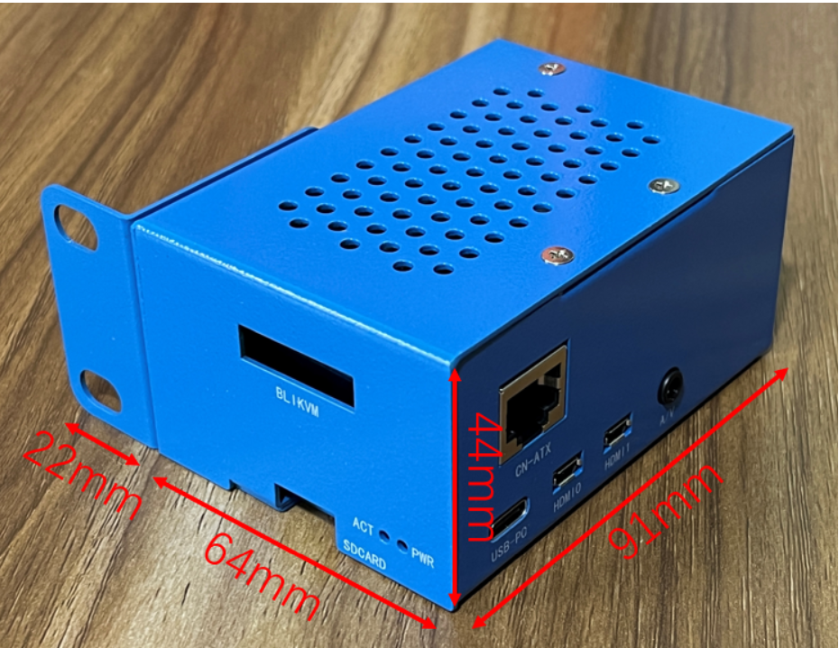

# BLIKVM HAT version guide
## **Introduction**

|                   PCB                    |                   Case                    |
|:----------------------------------------:|:-----------------------------------------:|
|  |  |

The Raspberry Pi IPKVM HAT is an add-on board for Raspberry Pi 4, made especially for KVM Over IP.  
BLIKVM-RPI4 is a Raspberry Pi 4 PoE KVM HAT.  This product’s key features include video capture, ATX adapter,PoE, OLED and RTC. The product has a customized metal case to dissipate heat and provide protection for the HAT. The product can be easily installed on a standard 1U rack. The product is currently perfectly compatible with blikvm image and pikvm image.

## **Installation requirements**
!!! note "If you have an assembly kit, you will need the following things"
    * Raspberry Pi 4B with 1Gb RAM or more.
    * HDMI cable.
    * Straight Ethernet cable (for the ATX board connection).
    * Power supply unit & cable(5.1V 3A USB-C, recommended by the Raspberry Pi).

## **Basic setup**
**1.** [Flash the memory card or eMMC ](./flashing_os.md) 

**2.Build BLIKVM** according to the video instruction or review the instructions:

??? info "Video Guide: Metal case step by step"
    <iframe width="560" height="315" src="https://www.youtube.com/embed/FaZBQUA7rAM" title="YouTube video player" frameborder="0" allow="accelerometer; autoplay; clipboard-write; encrypted-media; gyroscope; picture-in-picture" allowfullscreen></iframe>

## **Specification**
{width="600"}

??? note "**HDMI IN**"
    The bridge chip is Toshiba TC358743, which supports both video and audio(I2S), and the highest input resolution is 1080p@50fps.
    Fixed HDMI back power issue.

??? note "**CN-ATX**"
    The CN-ATX interface is connected to the ATX adapter board (an accessory for the HAT)through a network cable, which can turn on, 
    off, and restart the controlled computer.

??? note "**Display**"
    A white OLED display with a resolution of 128x32, and the chip is SSD1306. 
    This display can show the temperature, IP address and other information of the Raspberry Pi.

??? note "**PoE**"
    - **Standard:** IEEE 802.3af PoE
    - **Input voltage:** 37-57 V DC
    - **Output power:** 5 V DC/2.4 A
    - Plug in the PoE jumper cap to enable PoE power supply

??? note "**FAN**"
    The IPKVM HAT is fitted with a small fan that is controlled by your Raspberry Pi via GPIO12. 

??? note "**Real Time Clock (RTC)**"
    The clock chip is PCF8563 that is controlled by your Raspberry Pi via I2C. The coin cell battery is installed under the HDMI IN module.

## **Accessories**

### **ATX adapter board**

{width="300"}

This board is connected to the switch port on the motherboard of the controlled computer with DuPont cables. 
The board has a standard PCIe I/O bracket and a low profile PCIe  I/O bracket.

### **USB/PWR splitter**
{width="300"}

- Connect the RPI4 port to your Raspberry Pi 4.
- Connect the USB port to the controlled computer.
- When using PoE power supply, there is no need to connect the PWR port. When not using PoE power supply, connect the PWR port to a standard 5V/3A USB power supply.

### **HDMI pass-through EDID emulator**

{width="300"}

If the controlled computer does not output HDMI images correctly, please use this accessory. Connect the Source port to the controlled computer, connect the Sink port to the HAT. Then you can set the correct HDMI output on the controlled computer.

### **Metal case**

{width="300"}
The metal case protects the HAT and improve heat dissipation. There are clear port markings on the case.

The case can be easily installed on a standard 1U rack.

## **List**

### **Product List**
{width="300"}

| Raspberry Pi IPKVM HAT                 | 1    |
| -------------------------------------- | ---- |
| ATX adapter board                      | 1    |
| USB/PWR splitter                       | 1    |
| HDMI pass-through EDID emulator        | 1    |
| Metal case                             | 1    |
| 32G TF card                            | 1    |
| USB Type-C to USB Type-C Cable 30cm    | 1    |
| Dupont Cables 8pin Male to Male 40cm   | 1    |
| Dupont Cables 8pin Male to Female 40cm | 1    |
| Phillips screwdriver                   | 1    |
| Cross Wrench Sleeve                    | 1    |

### **List of items prepared by the user**

| Raspberry Pi 4                              | 1    |
| ------------------------------------------- | ---- |
| RJ45 network cable                          | 2    |
| USB Type-A to USB Type-C Cable              | 2    |
| HDMI cable                                  | 1    |
| PoE-sourcing equipment or 5V/3A USB adapter | 1    |
| CR1220 coin cell battery                    | 1    |
