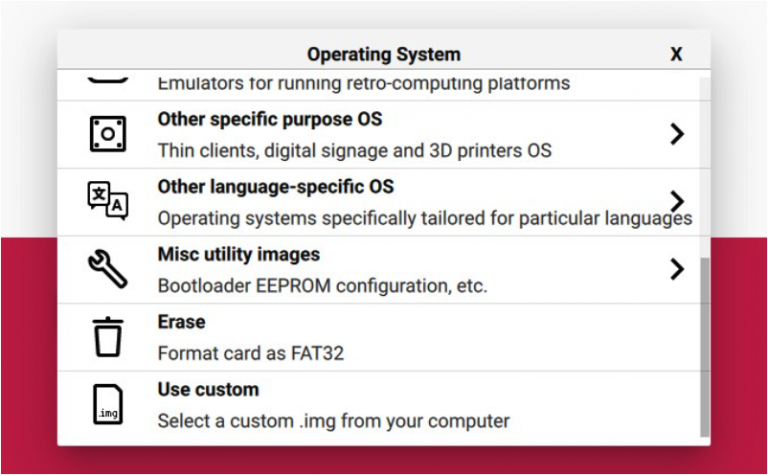
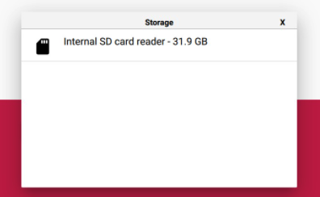
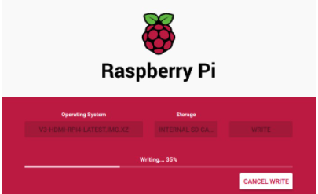

# Flashing the OS image

!!! warning "Micro-SD Card Requirements"
    * Minimum **16 Gb**
    * **Class 10** is strongly recommended

## Download the image

* **[PiKVM image (BLIKVM-CM4)](https://mgk9cjip0o.feishu.cn/file/boxcnYAhGhLxaEVOQdSrNiD1Pbg?from=from_copylink)**

## Flash the image

!!! tip
    Ignore request to format your sd card, this step is not nessessary. Choose the most suitable method for you.
    [How to flash the eMMC on a Raspberry Pi Compute Module 4](https://www.youtube.com/watch?v=jp_mF1RknU4)

### Board Link
First, use the jumper cap to short the boot pin.Then connect the data cable to the USB OTG interface.
Power on blikvm and observe the act light, the green light is always on.Taking Ubuntu system as an example:  
{width="300"}

!!! tip "EMMC knowledge"
    If you use raspberry pi computing modules such as CM3 or CM4 EMMC，you can initialize EMMC through the usbboot. Note that the EMMC version cannot directly use the SD card to start the image.
    From this video you can learn how to flash image quickly.[How to flash the eMMC on a Raspberry Pi Compute Module 4 video](https://www.youtube.com/watch?v=jp_mF1RknU4)

###  Linux usbboot
If you use an Micro-SD Card, you don't need to care about that.
```
# sudo apt-get install libusb-1.0-0-dev  
# git clone --depth=1 https://github.com/raspberrypi/usbboot
# cd usbboot
# make
# sudo ./rpiboot
```
If the content shown in the figure below appears, it indicates that EMMC initialization is successful.  
{width="300"}

### Using RPi Imager (Linux, MacOS and Windows)

1. Download and install **the latest version** of [RPi Imager](https://github.com/raspberrypi/rpi-imager/releases).

2. Run RPi Imager:  
{width="300"}  

3. Press **CHOOSE OS** and select **Use custom** image at bottom of the list:  
{width="300"}

4. After clicking on this item, select the image file (`.img.xz`), then click **CHOOSE STORAGE**:  
{width="300"}

5. Insert the memory card into the card reader. Choose the card reader from this list. **Be careful** 
and choose the right device:   

    {width="300"}

6. After choosing the memory card, press the **WRITE** button. Confirm the operation when you are asked about it:  
{width="300"} 

7. Wait for the process to finish. Get yourself a coffee or do some stretching :)  
!!! tip
    The process may hang at 99% for a long time, this is okay, just wait for it to complete
{width="300"}

8.Remove the memory card after successful completion:  

{width="300"}

!!! tip
    If an error occurs during flashing or booting PiKVM, repeat the process.