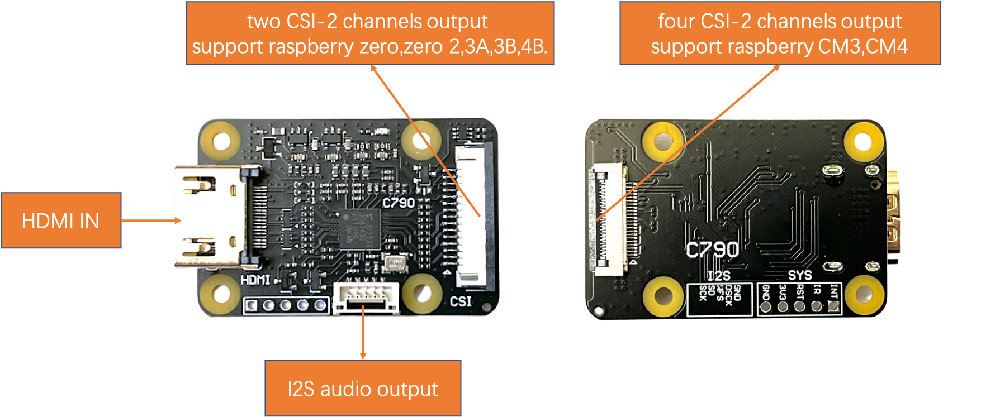
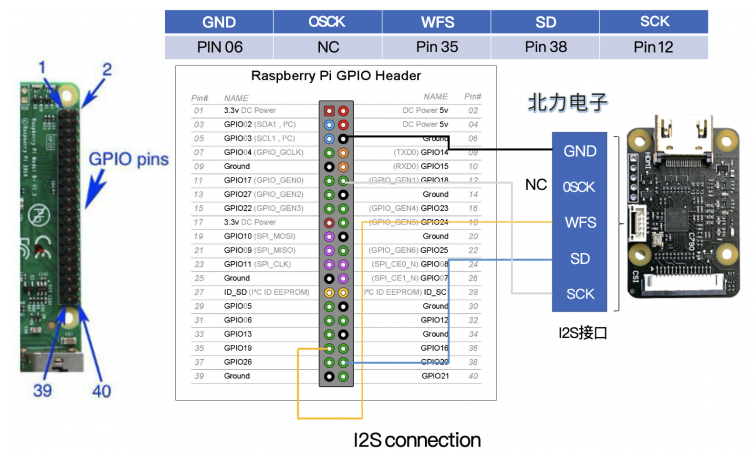
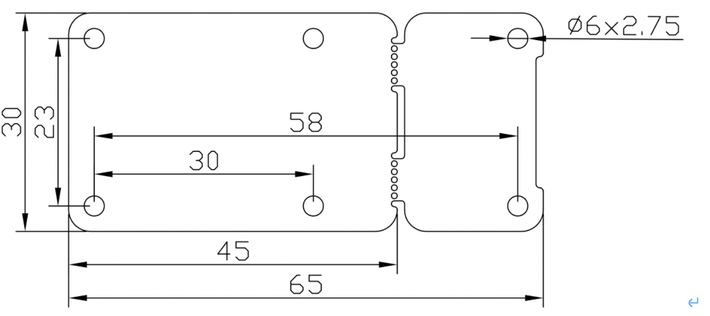
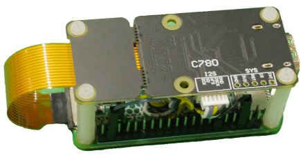
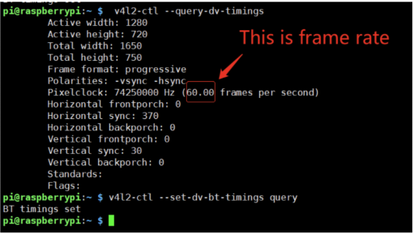
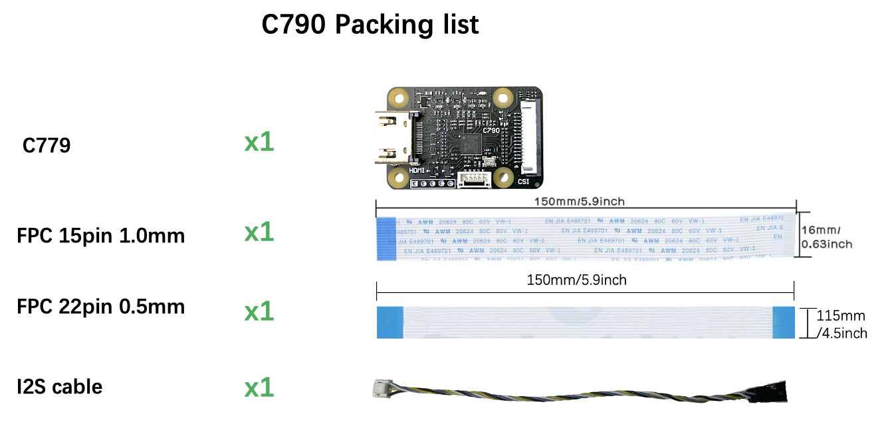

# HDMI to CSI&I2S bridge guide
> Convert HDMI signal acquisition into CSI signal and I2S audio signal.
## **Introduction**
This module takes the incoming HDMI signal and converts it into a separate CSI signal and I2S audio signal. 
HDMI input supports up to 1080P60Hz. It works well on raspberry pi, there are three versions of this module 
in history(C779、C780、C790). C790 is the latest version. C790 has mitigate HDMI backpowering,also has two csi 
channels and four csi channels at the same time.


## **Features**
### **C790**
!!! note "hardware parameters"
    * HDMI input: supports up to 1080P60Hz on Raspberry Pi
    * HDMI to CSI-2 bridge chip:Toshiba TC358743XBG
    * 4 CSI-2 channels & clock
    * The CSI-2 interface, with 15 pin FPC seat, spacing 1.0 mm, is located on the front of the C790 module.
    * The CSI-2 interface, with 22 pin FPC seat, spacing 0.5 mm, is located on the back of the C790 module.
    * Size: 30 x 45 mm
    * Install:4 x M2.5
    * Power supply:3.3V
    * Weight: 10g

!!! note "interface"
    {width="400"}  
    C790 has two csi output interface. In fornt of C790, the CSI-2 interface is 15 pin FPC seat, 
    spacing 1.0 mm. In back of C790, the CSI-2 interface is 22 pin FPC seat, spacing 0.5 mm.
    {width="400"}  

!!! note "size"
    {width="400"}  

### **C780**
??? info "C780A hardware parameters"
    * HDMI input: supports up to 1080P50Hz on raspberry pi(Limited by the number of CSI-2 channels)
    * HDMI to CSI-2 bridge chip:Toshiba TC358743XBG
    * 2 CSI-2 channels & clock
    * CSI-2 interface: 15 pin FPC seat, spacing 1.0 mm
    * Size: 30 x 65 mm (unbroken PCB size); 30 x 45 mm (PCB size after breaking)
    * Install:6 x M2.5
    * Power supply:3.3V
    * Weight: 10g
??? info "C780B hardware parameters"
    * HDMI input: supports up to 1080P60Hz on raspberry pi
    * HDMI to CSI-2 bridge chip:Toshiba TC358743XBG
    * 4 CSI-2 channels & clock
    * CSI-2 interface: 22 pin FPC seat, spacing 0.5 mm
    * Size: 30 x 65 mm (unbroken PCB size); 30 x 45 mm (PCB size after breaking)
    * Install:6 x M2.5
    * Power supply:3.3V
    * Weight: 10g
??? info "interface"
    {width="400"}  
    The wiring of audio part is shown in Figure.  
    {width="400"}
??? info "size"
    The size of C780 is shown in Figure. There are 6 mounting holes with a diameter of 2.75mm, 
    which are suitable for M2.5 screws.  
    {width="400"}  
    As shown in Figure, the user can directly fix the module on the raspberry pi zero.C780 is designed 
    to be broken, and the hole spacing before breaking can be perfectly installed with most series of 
    raspberry pi.
    {width="400"}

### **C779**
??? info "hardware parameters"
    * HDMI input: supports up to 1080P50Hz on raspberry pi(Limited by the number of CSI-2 channels)
    * HDMI to CSI-2 bridge chip:Toshiba TC358743XBG
    * 2 CSI-2 channels & clock
    * CSI-2 interface: 15 pin FPC seat, spacing 1.0 mm
    * Size: 35 x 50 mm 
    * Install:4 x M2.5
    * Power supply:3.3V
    * Weight: 10g

??? info "size"
    The size of C779 is shown in Figure. There are 4 mounting holes with a diameter of 2.75mm, 
    which are suitable for M2.5 screws.  
    {width="400"}  

## **Software demo**
The use guide of C790/C780/C779 depends on the official Raspberry Pi OS version you are using. 
Different versions have different usage methods. If you have some questions, Join our [BLIKVM Discord 
Community](https://discord.com/invite/9Y374gUF6C) for Support, FAQ & News!  
To use the kernel drivers, please update your system. There are a few things that have changed with the 
5.4 kernel, so these instructions are for 5.4 or later. If “uname -a” reports anything less, then fix 
this before proceeding.  
``` 
pi@raspberrypi:~ $ uname -a
Linux raspberrypi 5.10.63-v7l+ #1459 SMP Wed Oct 6 16:41:57 BST 2021 armv7l GNU/Linux
```
!!! note "1. Update & upgrade the raspberry pi system (It will take a long time depend on the different country)"
    ``` 
    sudo apt-get update
    sudo apt-get upgrade
    ``` 
!!! note "2. Enable camera module (the camera is enabled by default in Raspberry pi Bullseys OS)"
    ```
    sudo raspi-config
    sudo reboot
    ```
    Navigate to ‘Interfacing Options’ and hit Enter. Now select the ‘Camera’ option, and hit the Enter 
    key to enable it. Select “Finish” and select to reboot your Raspberry Pi. **reboot is important!!**
!!! note "3. Edit /boot/config.txt (that will need sudo)"
    ```
    sudo nano /boot/config.txt
    ```
    Add the line:
    ```
    dtoverlay=tc358743
    ```
    Add the line if your shield support audio like C780 or C790.
    ```
    dtoverlay=tc358743-audio
    ```
    please append the If (and only if) you have a device such as the C780 or C790 that supports the 22pin 
    connector with all 4 lanes wired out, and are using a Compute Module with the CAM1 connector that also 
    has all 4 lanes wired up, you can use:
    ```
    dtoverlay=tc358743,4lane=1
    ```
!!! note "4. Check the amount of memory assigned to the CMA heap with “dmesg | grep cma”. The first line 
    should be along the lines of"
    ```
    pi@raspberrypi:~ $ dmesg | grep cma
    [0.000000] cma: Reserved 256 MiB at 0x000000001ec00000
    ```
    If it reports less than 96MB assigned to CMA, then edit /boot/cmdline.txt and add to the start of the line. 
    Do NOT add any carriage returns.
    ```
    cma=96M
    ```
!!! note "5. Reboot. If all is well you should get a /dev/video0 device, and “v4l2-ctl –list-devices” will 
    tell you that it is provided by Unicam. After connecting all the cables, power on the Raspberry Pi, 
    the C790 indicator light is normally green, and after opening the Raspberry Pi terminal, enter the 
    following command:"
    ```
    pi@raspberrypi:~ $ ls /dev/video0
    /dev/video0
    pi@raspberrypi:~ $ v4l2-ctl --list-devices
    bcm2835-codec-decode (platform:bcm2835-codec):
        /dev/video10
        /dev/video11
        /dev/video12
        /dev/video18
        /dev/media1
    bcm2835-isp (platform:bcm2835-isp):
        /dev/video13
        /dev/video14
        /dev/video15
        /dev/video16
        /dev/media0
    unicam (platform:fe801000.csi):
        /dev/video0
        /dev/video1
        /dev/media2
    ```
!!! note "6. This driver puts all the control in the hands of the user, or the user’s application. 
    By default there is no EDID loaded into the chip to allow it to tell the HDMI source what 
    resolutions are supported. There are EDID editors around. If you create a file edid.txt, 
    then you can push this to the device using"
    The comment of edid.txt file:
    ```
    00ffffffffffff005262888800888888
    1c150103800000780aEE91A3544C9926
    0F505400000001010101010101010101
    010101010101011d007251d01e206e28
    5500c48e2100001e8c0ad08a20e02d10
    103e9600138e2100001e000000fc0054
    6f73686962612d4832430a20000000FD
    003b3d0f2e0f1e0a2020202020200100
    020321434e041303021211012021a23c
    3d3e1f2309070766030c00300080E300
    7F8c0ad08a20e02d10103e9600c48e21
    0000188c0ad08a20e02d10103e960013
    8e210000188c0aa01451f01600267c43
    00138e21000098000000000000000000
    00000000000000000000000000000000
    00000000000000000000000000000000
    ```
    ```
    cd ~
    sudo nano edid.txt
    #copy the above commend in edid.txt, save&exit;
    pi@raspberrypi:~ $ v4l2-ctl --set-edid=file=edid.txt --fix-edid-checksums
    
    CTA-861 Header
      IT Formats Underscanned: yes
      Audio:                   yes
      YCbCr 4:4:4:             no
      YCbCr 4:2:2:             no
    
    HDMI Vendor-Specific Data Block
      Physical Address:        3.0.0.0
      YCbCr 4:4:4 Deep Color:  no
      30-bit:                  no
      36-bit:                  no
      48-bit:                  no
    
    CTA-861 Video Capability Descriptor
      RGB Quantization Range:  yes
      YCC Quantization Range:  no
      PT:                      Supports both over- and underscan
      IT:                      Supports both over- and underscan
      CE:                      Supports both over- and underscan
    ```
!!! note "7. The driver does NOT automatically switch to the resolution detected. Use the command:"
    ```
    pi@raspberrypi:~ $ v4l2-ctl --query-dv-timings
	Active width: 1280
	Active height: 720
	Total width: 1650
	Total height: 750
	Frame format: progressive
	Polarities: -vsync -hsync
	Pixelclock: 74250000 Hz (60.00 frames per second)
	Horizontal frontporch: 0
	Horizontal sync: 370
	Horizontal backporch: 0
	Vertical frontporch: 0
	Vertical sync: 30
	Vertical backporch: 0
	Standards: 
	Flags: 
    ```
    You MUST set the timings via “v4l2-ctl –set-dv-bt-timings”. You can pass in an index to the detected mode, or use:
    ```
    v4l2-ctl --set-dv-bt-timings query
    ```
    to select the currently detected timings.
    ```
    v4l2-ctl -V
    ```
    should now reflect the resolution detected.

!!! note "8. The chip supports two formats – BGR3 (the default) and UYVY. BGR3 is 24bpp, and UYVY is YUV4:2:2 16bpp."
    Over the normal 2 CSI-2 lanes the data rate is such that BGR3 can run at a maximum of 1080p30, whilst UYVY will 
    go up to 1080p50. Use the following command to select UYVY, however your application may override that.
    ```
    v4l2-ctl -v pixelformat=UYVY
    ```
!!! note "9. Check that the audio drivers / card is available to ALSA."
    ```
    pi@raspberrypi:~ $ arecord -l
    **** List of CAPTURE Hardware Devices ****
    card 1: tc358743 [tc358743], device 0: bcm2835-i2s-dir-hifi dir-hifi-0 [bcm2835-i2s-dir-hifi dir-hifi-0]
      Subdevices: 1/1
      Subdevice #0: subdevice #0
    ```
    Note: card 1 means that the card number for the TC358743XBG is “1” and it might be different.

!!! note "10. Install GStreamer tool."
    ```
    sudo apt install gstreamer1.0-tools
    ```
    Check gstreamer tool version:
    ```
    pi@raspberrypi:~ $ gst-launch-1.0 --version
    gst-launch-1.0 version 1.18.4
    GStreamer 1.18.4
    http://packages.qa.debian.org/gstreamer1.0
    ```
    Note:
    Different versions have different command line parameters, which is very annoying.

!!! note "11. Use gstreamer to record video and audio"
    ```
    #GStreamer v1.14 command
    gst-launch-1.0 v4l2src io-mode=5 ! video/x-raw, format=UYVY, framerate=25/1 ! v4l2h264enc output-io-mode=4 ! video/x-h264,profile=high ! h264parse ! queue ! matroskamux name=mux ! filesink location=foo.mkv alsasrc device=hw:1 ! audio/x-raw,rate=48000,channels=2 ! audioconvert ! avenc_aac bitrate=48000 ! aacparse ! queue ! mux.
    ```
    foo.mkv is the output file.
    If your gstreamer is version 1.8 or above, you can try the following test command. In addition, alsasrc 
    device=hw:1 represents the sound card of TC358743, you can use “arecord -l” to query.
    ```
    #The command to recode a video with audio. (GStreamer 1.18.4)
    gst-launch-1.0 -vvv v4l2src ! "video/x-raw,framerate=30/1,format=UYVY" ! v4l2h264enc extra-controls="controls,h264_profile=4,h264_level=13,video_bitrate=256000;" ! "video/x-h264,profile=high, level=(string)4.2" ! h264parse ! queue ! matroskamux name=mux ! filesink location=foo.mkv alsasrc device=hw:1 ! audio/x-raw,rate=48000,channels=2 ! audioconvert ! avenc_aac bitrate=48000 ! aacparse ! queue ! mux.
    #The sample command to recode a video without audio. (C779 doesn't support audio)
    gst-launch-1.0 -vvv v4l2src ! "video/x-raw,framerate=30/1,format=UYVY" ! v4l2h264enc extra-controls="controls,h264_profile=4,h264_level=13,video_bitrate=256000;" ! "video/x-h264,profile=high, level=(string)4.2" ! h264parse ! queue ! matroskamux name=mux ! filesink location=foo.mkv
    Press CTRL+C to end recording.
    ```
    PS: We recommend that you modify the above framerate parameter to the actual frame rate of your HDMI signal, 
    the actual frame rate value is from the result of ‘v4l2-ctl –query-dv-timings’ command.
    {width="400"}
    For the above HDMI device, because the frame rate is 60, so we modify the framerate parameter to 60 like the followint command.
    Record the video only:
    ```
    gst-launch-1.0 -vvv v4l2src ! "video/x-raw,framerate=60/1,format=UYVY" ! v4l2h264enc extra-controls="controls,h264_profile=4,h264_level=13,video_bitrate=256000;" ! "video/x-h264,profile=high, level=(string)4.2" ! h264parse ! queue ! matroskamux name=mux ! filesink location=foo.mkv
    ```
    Record the video and audio: (if your shield supports audio also)
    ```
    gst-launch-1.0 -vvv v4l2src ! "video/x-raw,framerate=60/1,format=UYVY" ! v4l2h264enc extra-controls="controls,h264_profile=4,h264_level=13,video_bitrate=256000;" ! "video/x-h264,profile=high, level=(string)4.2" ! h264parse ! queue ! matroskamux name=mux ! filesink location=foo.mkv alsasrc device=hw:1 ! audio/x-raw,rate=48000,channels=2 ! audioconvert ! avenc_aac bitrate=48000 ! aacparse ! queue ! mux.
    ```
    Note: alsasrc device=hw:1 – “1” means the audio card number, You must change to correct audio card number.
    (Query the car number via ‘arecord –l’, refer to step 9)

## **Packing List**
??? info "C790"
    {width="400"}

## **Test video**
C780A test:https://www.youtube.com/watch?v=ecqyINoiHNQ

C780B test:https://www.youtube.com/watch?v=nc-hwPT2Uak&t=15s

## **Purchase link**
Purchase：<a href="https://www.aliexpress.com/item/1005002861310912.html?pdp_ext_f=%7B%22sku_id%22:%2212000022635165947%22,%22ship_from%22:%22CN%22%7D&gps-id=pcStoreJustForYou&scm=1007.23125.137358.0&scm_id=1007.23125.137358.0&scm-url=1007.23125.137358.0&pvid=8e29d7e9-f257-4f20-a0b2-c2bff6a048d6&spm=a2g0o.store_pc_home.smartJustForYou_6000897758043.1" target="_blank">C790 & C780</a>

Purchase：<a href="https://www.aliexpress.com/item/1005003033156483.html?spm=a2g0o.productlist.0.0.36f93cc2DFaouV&algo_pvid=2bfab2d1-a9c7-4c29-9434-2f451401d0e1&algo_exp_id=2bfab2d1-a9c7-4c29-9434-2f451401d0e1-9&pdp_ext_f=%7B%22sku_id%22%3A%2212000023351081819%22%7D" target="_blank">C779</a>
