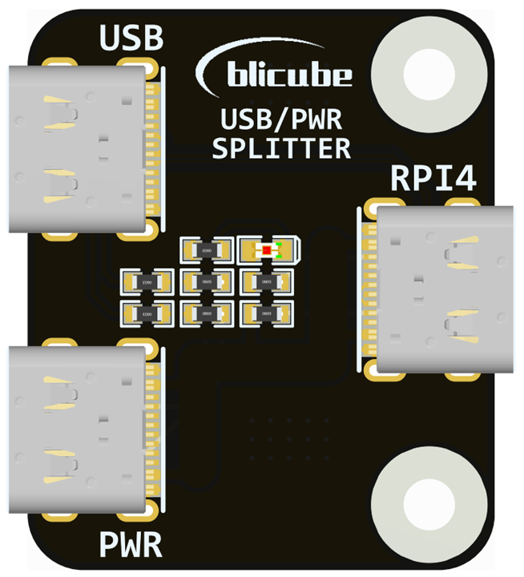
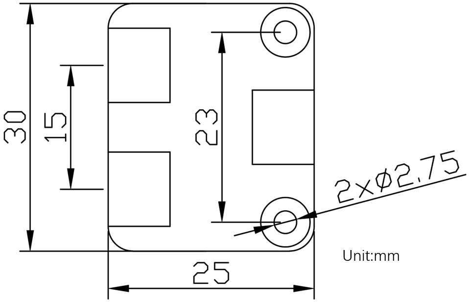

# USB/PWR Splitter guide

## **1. Introduction**

The adaptor allows the Raspberry Pi 4 to be used with a Pi USB-C power supply while allowing access to USB OTG data over a separate USB-C connection.

USB-C (RPI4) <> USB-C (USB) and USB-C (PWR)

|   USB-C(RPI4)   |  USB Type-C(USB)  |  USB Type-C(PWR)  |
|:---------------:|:-----------------:|:-----------------:|
|       5V        |                   |        5V         |
|       D-        |        D-         |                   |
|       D+        |        D+         |                   |
|  CC1 10k to 5V  |  CC1 5.1k to GND  |  CC1 5.1k to GND  |
|  CC2 10k to 5V  |  CC2 5.1k to GND  |  CC2 5.1k to GND  |
|       GND       |        GND        |        GND        |

To use the adaptor with the Raspberry Pi 4 you need.

- USB-C to USB-C cable[1] between Pi4 and the adaptor board
- USB-C to USB-C or Type-A between adaptor board and PC
- Power[2] via Official Raspberry Pi USB Type-C Power Supply.

[1] Whilst USB-C cables are generally designed for higher current I still advise using short power cable to the Pi where possible to reduce voltage drop.

[2] **PLEASE NOTE** With the Pu/Pd resistors on this board it can only be used with 5V supply to power a 5V device.

An adaptor of this kind does not fall within the USB specification. It's designed for use with the official Raspberry Pi USB-C power supply and raspberry pi, use with other power supplies/chargers and devices may cause issues/damage.

## **2.Mechanical Diagram**

## **3.Test video**

[USB splitter](https://www.youtube.com/watch?v=4Od5MjBHbhY)
